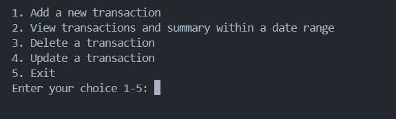
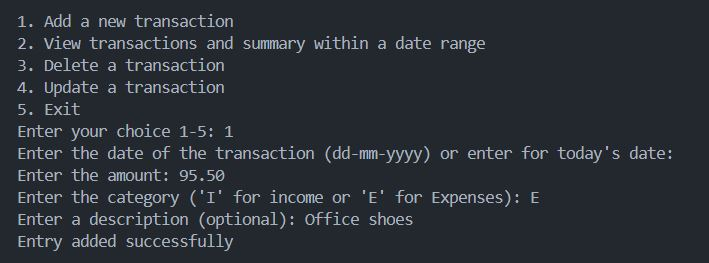
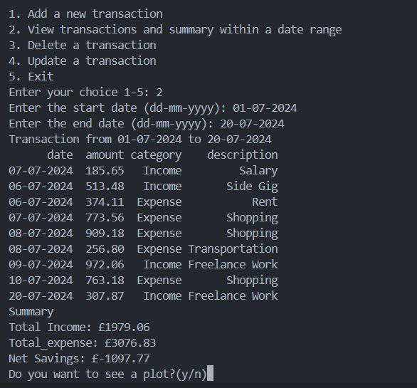
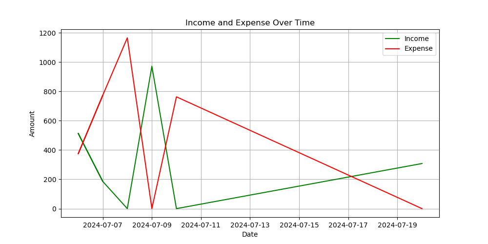
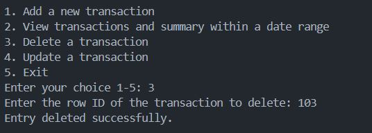
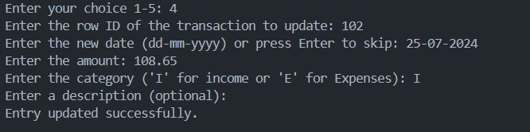
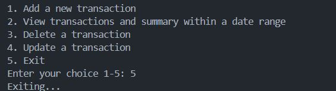

# Introduction

Here is a personal finance tracker application, a full-fledged CRUD application developed with Python, that allows a user to track their finances over a period of time and can also see a graph of their finances over a selected period of time.

The user can add entries, view entries, update as well as delete entries.

# Tools Used:

- **CSV:** CSV files are efficient and lightweight for storing large datasets and because they are plain text files, they are compatible with different platforms and systems, making them easy to read, write, and edit with minimal software requirements.

- **Python:** Python is the number one choice for this project, the versatility and extensive library made it so. Python is easy to use and read and it has a large community that is active which provides extensive documentation, support, and facilitates problem-solving.

- **Git and GitHub:** These are essential for version control and sharing my Python application, they also allow for collaboration and project tracking.

# Application Key Elements:

The application contains three main files - [main.py](/python_files/main.py), [data_entry.py](/python_files/data_entry.py), and [finance_data.csv](/csv_load/finance_data.csv).

## Key Elements from main.py

- **CSV class:** This class handles all operations that relate to the CSV file and this includes - initializing, adding, retrieving, updating, and deleting entries.

- **add() Function:** The purpose of this function is to prompt the user to enter details of a new transaction and add it to the CSV.

- **plot_transactions() Function:** This function plots the income and expense data over time using **'matplotlib'**.

- **main() Function:** This enables the user to interact with the system using a command-line interface. It offers options such as add, view, delete, update transactions, or exit.

- **get_transactions() Function:** This helps to retrieve transactions over a period of time which is going to be selected by the user.

- **update_entry():** This function helps to update an entry in the CSV file by identifying the entry with the row ID.

- **delete_entry():** This function helps to delete an entry from the CSV file by identifying the entry with the row ID.

## Key Elements from data_entry.py

- **date_format:** This specifies the format of the date to be used for parsing and formatting ('%d-%m-%Y' stands for day-month-year).

- **CATEGORIES:** This is a dictionary mapping short-form inputs (E for expense and I for income) to full category names.

- **get_date():** This prompts the user to enter a date and validates the input according to the date format specified. If **allow_default** is set to **True** and the user presses enter without providing a date, the current date is returned.

- **get_amount():** This prompts the user to enter a positive and non-zero number, it checks and handles invalid and negative inputs.

- **get_category():** This enables the user to specify the category of their transaction, whether it is an income or an expense, it ensures inputs are valid and also provides corresponding category names.

- **get_description():** This allows the user to describe the transaction, this is completely optional.

## CLI (Command-Line Interface) screenshots:

### Main menu

_This is the main menu of the application, the user selects any option they want to make use of._

### Adding new entry

_This screenshot shows option one (adding a new transaction) in use with all the parameters duly filled._

### Viewing transaction and Summary

_This screenshot shows option two in use showing transactions and summary from 01-07-2024 to 20-07-2024._

_Here is the graph plotted for the same timeframe selected above._

### Delete a transaction

_This screenshot shows option three (deleting a transaction) which is done by selecting the row ID of the entry in the CSV file._

### Update a transaction

_This screenshot shows option four in use (updating a transaction) which is done by selecting the row ID of the entry in the CSV file._

### Terminating the application

_Option five exits the application._

